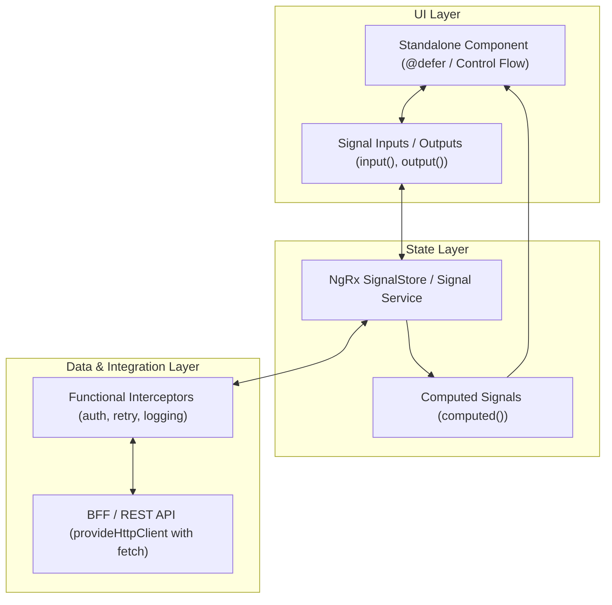

# Angular Skill: Angular 22+, Signals & Modern Web Architecture

Esta skill orienta o desenvolvimento de aplicações web corporativas de alto desempenho utilizando as convenções mais modernas do ecossistema Angular (v17 a v22+).

---

## Quando Utilizar Esta Skill

Consulte e ative esta skill ao:
1. Projetar e estruturar aplicações web Angular modernas utilizando componentes, diretivas e pipes **100% Standalone** (sem `NgModule`).
2. Implementar fluxo reativo com **Angular Signals** (`signal`, `computed`, `effect`, `input()`, `output()`, `model()`).
3. Configurar aplicações **Zoneless** utilizando `provideExperimentalZonelessChangeDetection()` para alta performance e Core Web Vitals otimizados.
4. Utilizar a sintaxe nativa de **Control Flow** (`@if`, `@for (track)`, `@switch`, `@let`) e **Deferrable Views** (`@defer`).
5. Gerenciar estados complexos com **NgRx SignalStore** ou Services reativos orientados a Signals.
6. Configurar comunicação HTTP com `provideHttpClient(withFetch(), withInterceptors())`.
7. Aplicar práticas de segurança (sanitização XSS via `DomSanitizer`, Content Security Policy - CSP).
8. Escrever testes unitários modernos com Vitest / Web Test Runner e testes E2E com Playwright.

---

## 1. Princípios Arquiteturais do Angular Moderno



### 1.1. Standalone First (Regra Obrigatória)
- Toda entidade Angular (`Component`, `Directive`, `Pipe`) deve ser declarada como `standalone: true` (padrão nas versões recentes).
- Elimine módulos intermediários (`SharedModule`, `FeatureModule`). Importe apenas dependências estritamente necessárias diretamente no array `imports` do componente.

### 1.2. Reatividade Nativa com Signals
- **Estado Mutável:** Utilize `signal<T>(initialValue)` para estados locais ou compartilhados.
- **Valores Derivados:** Utilize `computed(() => calculate(this.state()))` para computações puras e memorizadas.
- **Efeitos Colaterais:** Utilize `effect()` exclusivamente para sincronizações externas (ex: logging, APIs de terceiros, canvas/DOM). Nunca altere sinais dentro de `effect` sem extrema necessidade (`allowSignalWrites`).
- **Inputs & Outputs Modernos:**
  ```typescript
  export class UserCardComponent {
    // Signal-based input (obrigatório ou opcional)
    readonly userId = input.required<string>();
    readonly role = input<string>('guest');
    
    // Signal-based model (two-way binding)
    readonly isExpanded = model<boolean>(false);
    
    // Output declarativo
    readonly userSelected = output<string>();
  }
  ```

### 1.3. Zoneless Change Detection
- Configure o bootstrapping da aplicação com `provideExperimentalZonelessChangeDetection()` no `app.config.ts`.
- Remova `zone.js` dos polyfills para reduzir o bundle size e eliminar a sobrecarga de monkey-patching em eventos globais.
- A detecção de mudanças é disparada automaticamente pela leitura de Signals na árvore de templates e por eventos do usuário.

### 1.4. Novo Control Flow & Deferrable Views
Substitua completamente diretivas estruturais legadas (`*ngIf`, `*ngFor`, `*ngSwitch`):

```html
<!-- Control Flow Moderno -->
@if (user(); as currentUser) {
  <div class="user-header">
    <h3>{{ currentUser.name }}</h3>
    @let roleBadge = currentUser.isAdmin ? 'Admin' : 'Member';
    <span class="badge">{{ roleBadge }}</span>
  </div>
} @else {
  <p>Carregando perfil...</p>
}

<!-- Iteração com rastreamento obrigatório -->
@for (item of items(); track item.id) {
  <app-item-card [data]="item" />
} @empty {
  <app-empty-state message="Nenhum item encontrado." />
}

<!-- Deferrable Views para otimização de performance -->
@defer (on viewport; prefetch on idle) {
  <app-heavy-chart [data]="metrics()" />
} @placeholder (minimum 300ms) {
  <app-skeleton-chart />
} @loading {
  <app-spinner />
} @error {
  <app-error-retry (retry)="reload()" />
}
```

---

## 2. Gerenciamento de Estado: NgRx SignalStore

Para estados de feature ou globais complexos, padronize no **NgRx SignalStore**:

```typescript
import { signalStore, withState, withComputed, withMethods, patchState } from '@ngrx/signals';
import { inject, computed } from '@angular/core';
import { rxMethod } from '@ngrx/signals/rxjs-interop';
import { pipe, switchMap, tap } from 'rxjs';
import { UserService } from './user.service';

interface UserState {
  users: User[];
  isLoading: boolean;
  filter: string;
}

const initialState: UserState = {
  users: [],
  isLoading: false,
  filter: '',
};

export const UserStore = signalStore(
  { providedIn: 'root' },
  withState(initialState),
  withComputed(({ users, filter }) => ({
    filteredUsers: computed(() => {
      const q = filter().toLowerCase();
      return users().filter(u => u.name.toLowerCase().includes(q));
    }),
    totalUsers: computed(() => users().length),
  })),
  withMethods((store, userService = inject(UserService)) => ({
    setFilter(filter: string) {
      patchState(store, { filter });
    },
    loadUsers: rxMethod<void>(
      pipe(
        tap(() => patchState(store, { isLoading: true })),
        switchMap(() => userService.getUsers()),
        tap(users => patchState(store, { users, isLoading: false }))
      )
    ),
  }))
);
```

---

## 3. Segurança & Proteção Web no Angular

1. **Proteção contra Cross-Site Scripting (XSS):**
   - O compilador do Angular escapa strings interpoladas `{{ ... }}` por padrão.
   - **Regra Rígida:** Nunca utilize `bypassSecurityTrustHtml`, `bypassSecurityTrustScript` ou `bypassSecurityTrustResourceUrl` do `DomSanitizer` sem validação estrita ou sanitização prévia via biblioteca segura (ex: DOMPurify).
2. **Content Security Policy (CSP):**
   - Não utilize estilos inline dinâmicos sem hashes ou nonces.
   - Configure o servidor / meta tag CSP para bloquear `unsafe-eval` e `unsafe-inline`.
3. **Autenticação Segura & Tokens:**
   - Evite armazenar tokens JWT sensíveis em `localStorage`. Prefira cookies `HttpOnly; Secure; SameSite=Strict` integrados via BFF (Backend for Frontend).
   - Utilize interceptors funcionais (`HttpInterceptorFn`) com `withInterceptors` para tratamento de renovação de sessão e headers de rastreamento (Correlation ID).

---

## 4. Testes Automatizados no Angular

1. **Testes Unitários de Componentes:** Foco na renderização e interação do usuário através de Signals.
2. **Testes de SignalStores:** Valide transições de estado como funções puras sem a necessidade de instanciar componentes.
3. **Testes E2E com Playwright:** Cobrem fluxos críticos de ponta a ponta em múltiplos browsers (Chromium, Firefox, WebKit).

---

## 5. Referências Detalhadas

- [Signals e Gestão de Estado](./references/signals-and-state.md)
- [Standalone, Control Flow e Performance](./references/standalone-and-control-flow.md)
- [Segurança, CSP e Testes](./references/security-and-testing.md)
