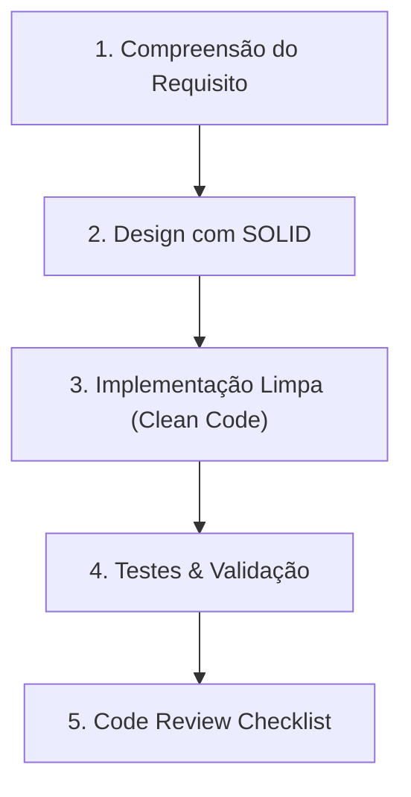

# Engineering Skill: SOLID & Clean Code Standards

Esta skill fornece uma base prática e rigorosa para guiar o agente e os desenvolvedores na criação de software com alta sustentabilidade, testabilidade e elegância de design.

---

## Quando Utilizar Esta Skill

Ative e consulte esta skill nas seguintes situações:
1. **Design e Modelagem Inicial:** Ao estruturar novas classes, módulos, serviços ou endpoints.
2. **Implementação de Funcionalidades:** Ao escrever código novo para garantir nomenclatura clara, responsabilidades isoladas e ausência de efeitos colaterais.
3. **Refatoração:** Ao identificar *code smells*, acoplamento excessivo ou classes gigantes (*God Objects*).
4. **Code Review e Verificação:** Ao revisar PRs ou alterações antes de considerar uma tarefa finalizada.

---

## Fluxo de Execução Recomendado

Ao executar tarefas de engenharia de software, siga este fluxo:

### Passo 1: Design com Princípios SOLID
Antes de escrever código, valide a estrutura pretendida contra os 5 princípios:
- **SRP (Single Responsibility):** O componente tem apenas um motivo para mudar?
- **OCP (Open/Closed):** É possível adicionar novas variantes sem editar a classe base?
- **LSP (Liskov Substitution):** Subtipos honram os contratos das classes base?
- **ISP (Interface Segregation):** Clientes dependem apenas do que realmente usam?
- **DIP (Dependency Inversion):** Depende de abstrações injetadas e não de implementações concretas?

> 📖 **Guia Completo de SOLID:** Consulte [`solid-principles.md`](./references/solid-principles.md) para exemplos de código, anti-padrões e soluções arquiteturais.

---

### Passo 2: Implementação com Clean Code
Durante a escrita do código:
- Dê nomes expressivos a variáveis e métodos (evite abreviações crípticas e tipos no nome).
- Mantenha métodos curtos (um nível de abstração por função).
- Evite efeitos colaterais e parâmetros excessivos (agrupe em objetos/DTOs).
- Trate erros de forma explícita com exceções de domínio; evite propagar `null`.
- Aplique **DRY**, **KISS** e **YAGNI**.

> 📖 **Guia Completo de Clean Code:** Consulte [`clean-code.md`](./references/clean-code.md) para regras detalhadas e boas práticas.

---

### Passo 3: Verificação e Revisão de Qualidade
Antes de entregar a solução:
1. Garanta que testes unitários cubram a lógica principal e cenários de borda.
2. Execute o checklist de revisão contra todas as alterações realizadas.

> 📋 **Checklist de Revisão:** Consulte [`code-review-checklist.md`](./references/code-review-checklist.md) para checagem ponto a ponto.
