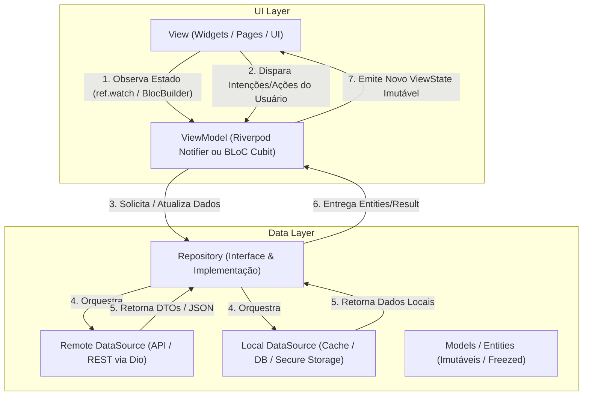

---
name: flutter
description: >-
  Diretrizes, padrões e boas práticas para desenvolvimento de aplicações móveis e multiplataforma
  com Flutter e Dart. Cobre arquitetura MVVM, gerenciamento de estado com Riverpod (padrão principal)
  e BLoC/Cubit (alternativa escalável), ViewModels, Repositories, UI declarativa com Material 3
  e testes automatizados. Ative ao criar, refatorar ou depurar aplicativos Flutter.
---

# Flutter Skill: Arquitetura MVVM, Riverpod & BLoC

Esta skill orienta o desenvolvimento de aplicações Flutter corporativas, sustentáveis e de alta performance, alinhadas às diretrizes oficiais do ecossistema Flutter.

---

## Quando Utilizar Esta Skill

Consulte esta skill ao:
1. Estruturar novos projetos, módulos ou features em Flutter utilizando o padrão **MVVM** (*Model-View-ViewModel*).
2. Implementar gerenciamento de estado reativo com **Riverpod** (abordagem principal baseada em `Notifier`/`AsyncNotifier`) ou **BLoC / Cubit** (abordagem orientada a eventos e fluxos).
3. Projetar e implementar camadas de dados com **Repositories**, **DataSources** (HTTP via `Dio`, persistência local com `Isar`/`Hive`/`SharedPreferences`) e DTOs/Entities com imutabilidade (`freezed`).
4. Desenvolver interfaces com **Material 3**, suporte a Dark/Light Theme e tokens de design customizados via `ThemeExtension`.
5. Implementar navegação declarativa e profunda com **GoRouter**.
6. Escrever testes automatizados (unitários de ViewModels e Repositories com `mocktail`, testes de widgets e de integração).

---

## O Padrão MVVM no Flutter

A arquitetura recomendada pelo Flutter separa a aplicação em camadas bem definidas e desacopladas:

1. **View (UI):** Widgets desacoplados que renderizam o estado atual do ViewModel e delegam ações do usuário (cliques, digitação, pull-to-refresh) para o ViewModel. Não contém regras de negócio.
2. **ViewModel:** Gerencia o estado da tela (`ViewState`), orquestra chamadas para os Repositories e transforma dados de modelo em formatos prontos para exibição.
   - **Abordagem Primária:** **Riverpod** (`NotifierProvider` / `AsyncNotifierProvider`).
   - **Abordagem Alternativa:** **BLoC / Cubit** (`Cubit<State>` ou `Bloc<Event, State>`).
3. **Repository (Model):** Ponto único de verdade para dados da funcionalidade. Decide se busca dados remotos, cache local, e converte respostas externas em entidades de domínio.
4. **Data Sources:** Comunicação direta com serviços externos (HTTP, Bluetooth, SQLite, Firebase, etc.).

---

## Princípios Fundamentais de Desenvolvimento Flutter

1. **Imutabilidade em Primeiro Lugar:** Estados de tela e modelos devem ser estritamente imutáveis. Utilize `freezed` ou Dart 3 Records/Classes imutáveis com `copyWith`.
2. **Nunca Coloque Lógica de Negócio em Widgets:** Widgets devem ser meros declaradores de interface. Regras, validações de negócio e formatações complexas pertencem ao ViewModel.
3. **Tratamento de Estado Assíncrono com Triplo Estado:** Toda operação assíncrona deve cobrir explicitamente os estados de **Loading**, **Error** (com mensagens amigáveis) e **Data/Success** (ex: `AsyncValue` no Riverpod).
4. **Injeção de Dependências:** O ViewModel recebe seus Repositories via injeção de dependência (via `ref` do Riverpod ou `get_it`/`RepositoryProvider` no BLoC).
5. **Roteamento Declarativo:** Utilize `GoRouter` para gerenciar rotas de forma previsível, com suporte a *deep links*, parâmetros tipados e redirecionamentos de autenticação (*guards*).
6. **Performance de Renderização:** Sempre que possível, utilize construtores `const`, evite recriar instâncias anônimas em loops e use `ListView.builder` para coleções dinâmicas.

---

## Guias Detalhados de Referência

- 📘 **[Arquitetura MVVM e Organização de Pastas](./references/mvvm-architecture.md):** Estrutura Feature-First vs Layer-First, responsabilidades de cada camada, injeção de dependências e navegação com GoRouter.
- 📘 **[Gerenciamento de Estado: Riverpod & BLoC/Cubit](./references/state-management.md):** Padrões completos de código para Riverpod (Notifier, AsyncNotifier, AsyncValue) e BLoC/Cubit, comparação e guia de migração.
- 📘 **[Estratégia e Padrões de Testes](./references/testing.md):** Testes unitários de ViewModels e Repositories com `mocktail`, testes de widgets com `testWidgets` e mocks de providers/blocs.
- 📘 **[UI, Material 3 e Design System](./references/ui-and-theming.md):** ThemeData, ColorScheme, tokens customizados com ThemeExtension, suporte a Dark Mode e boas práticas de layout responsivo.