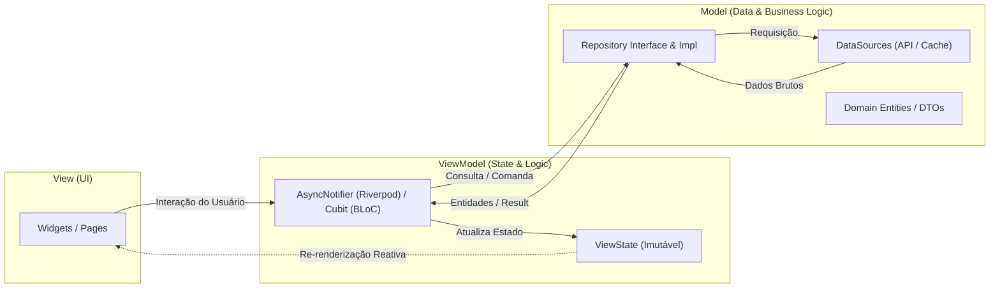

# Arquitetura MVVM no Flutter

O padrão **Model-View-ViewModel (MVVM)** é a arquitetura oficialmente recomendada pela documentação do Flutter para criação de aplicativos modulares, testáveis e escaláveis.

---

## 1. Responsabilidades das Camadas



### 1.1. View (Camada de Apresentação Visual)
- **O que faz:** Renderiza a interface do usuário e captura eventos (taps, inputs, gestos).
- **Regra de Ouro:** Não contém nenhuma regra de negócio ou lógica assíncrona. Não instancia clientes HTTP, repositórios ou bancos locais diretamente.
- **Implementação:** No Riverpod estende `ConsumerWidget` ou `ConsumerStatefulWidget`. No BLoC utiliza `BlocBuilder`, `BlocListener` ou `BlocConsumer`.

### 1.2. ViewModel (Gerenciador de Estado da View)
- **O que faz:**
  - Mantém e expõe o estado atual da tela (`ViewState`) como um objeto imutável.
  - Processa os eventos/intenções emitidos pela View e invoca métodos nos Repositórios.
  - Converte dados brutos do modelo em formatos prontos para apresentação na tela (ex: formatar moedas, datas, validação de campos).
- **Regra de Ouro:** O ViewModel **nunca importa pacotes de UI** (`dart:ui` ou `package:flutter/material.dart` com dependência de `BuildContext`). Isso garante testabilidade 100% isolada e rápida.

### 1.3. Model (Camada de Dados e Domínio)
- **Entidades (Entities):** Objetos de negócio imutáveis que representam os conceitos fundamentais do sistema.
- **Repositórios (Repositories):** Ponto único de contato para o ViewModel. Abstraem a origem dos dados (rede, cache em memória, banco SQLite local).
- **DataSources:** Implementam chamadas concretas para APIs externas (ex: Dio HTTP Client) ou mecanismos de persistência local (SharedPreferences, Isar, Drift, Hive).

---

## 2. Estrutura de Pastas Recomendada (Feature-First)

A organização recomendada é orientada a funcionalidades (**Feature-First**), permitindo que cada funcionalidade seja independente:

```text
lib/
├── app/
│   ├── app.dart                   # MaterialApp / ProviderScope / MaterialApp.router
│   ├── router/
│   │   └── app_router.dart        # Configuração do GoRouter
│   └── theme/
│       ├── app_theme.dart         # ThemeData (Light/Dark)
│       └── app_colors.dart        # Paleta de cores e tokens
├── core/
│   ├── errors/
│   │   ├── exceptions.dart        # ServerException, CacheException
│   │   └── failures.dart          # ServerFailure, NetworkFailure
│   ├── network/
│   │   ├── dio_client.dart        # Instância configurada do Dio com interceptors
│   │   └── api_endpoints.dart
│   └── utils/
│       └── result.dart            # Padrão Result<Success, Failure>
└── features/
    └── products/
        ├── data/
        │   ├── datasources/
        │   │   ├── products_remote_datasource.dart
        │   │   └── products_local_datasource.dart
        │   ├── models/
        │   │   └── product_dto.dart          # Serialização JSON / Freezed
        │   └── repositories/
        │       └── products_repository_impl.dart
        ├── domain/
        │   ├── entities/
        │   │   └── product.dart              # Entidade pura
        │   └── repositories/
        │       └── products_repository.dart  # Contrato abstrato (Interface)
        └── presentation/
            ├── viewmodels/
            │   ├── product_list_viewmodel.dart
            │   └── product_list_state.dart
            └── views/
                ├── product_list_page.dart
                └── widgets/
                    └── product_card.dart
```

---

## 3. Implementação Prática do MVVM

### 3.1. Contrato e Entidade do Modelo
```dart
// domain/entities/product.dart
class Product {
  final String id;
  final String title;
  final double price;

  const Product({
    required this.id,
    required this.title,
    required this.price,
  });
}

// domain/repositories/products_repository.dart
abstract class ProductsRepository {
  Future<List<Product>> getProducts();
}
```

### 3.2. Implementação do Repositório (Data Layer)
```dart
// data/repositories/products_repository_impl.dart
class ProductsRepositoryImpl implements ProductsRepository {
  final ProductsRemoteDataSource remoteDataSource;

  ProductsRepositoryImpl({required this.remoteDataSource});

  @override
  Future<List<Product>> getProducts() async {
    final dtos = await remoteDataSource.fetchProducts();
    return dtos.map((dto) => dto.toEntity()).toList();
  }
}
```

### 3.3. ViewModel com Riverpod
```dart
// presentation/viewmodels/product_list_viewmodel.dart
import 'package:riverpod_annotation/riverpod_annotation.dart';
import '../../domain/entities/product.dart';
import '../../domain/repositories/products_repository.dart';

part 'product_list_viewmodel.g.dart';

@riverpod
class ProductListViewModel extends _$ProductListViewModel {
  late final ProductsRepository _repository;

  @override
  FutureOr<List<Product>> build() async {
    _repository = ref.watch(productsRepositoryProvider);
    return _fetchProducts();
  }

  Future<List<Product>> _fetchProducts() async {
    return _repository.getProducts();
  }

  Future<void> refresh() async {
    state = const AsyncValue.loading();
    state = await AsyncValue.guard(() => _fetchProducts());
  }
}
```

### 3.4. View (UI Widget)
```dart
// presentation/views/product_list_page.dart
import 'package:flutter/material.dart';
import 'package:flutter_riverpod/flutter_riverpod.dart';
import '../viewmodels/product_list_viewmodel.dart';

class ProductListPage extends ConsumerWidget {
  const ProductListPage({super.key});

  @override
  Widget build(BuildContext context, WidgetRef ref) {
    final state = ref.watch(productListViewModelProvider);

    return Scaffold(
      appBar: AppBar(title: const Text('Produtos')),
      body: state.when(
        data: (products) => ListView.builder(
          itemCount: products.length,
          itemBuilder: (context, index) {
            final product = products[index];
            return ListTile(
              title: Text(product.title),
              subtitle: Text('R$ ${product.price.toStringAsFixed(2)}'),
            );
          },
        ),
        loading: () => const Center(child: CircularProgressIndicator()),
        error: (error, _) => Center(
          child: Column(
            mainAxisSize: MainAxisSize.min,
            children: [
              Text('Erro: $error'),
              const SizedBox(height: 12),
              ElevatedButton(
                onPressed: () => ref.read(productListViewModelProvider.notifier).refresh(),
                child: const Text('Tentar novamente'),
              ),
            ],
          ),
        ),
      ),
    );
  }
}
```

---

## 4. Navegação Declarativa com GoRouter

Adote o `GoRouter` para gerenciar rotas de forma centralizada:

```dart
// app/router/app_router.dart
import 'package:go_router/go_router.dart';
import '../../features/products/presentation/views/product_list_page.dart';

final appRouter = GoRouter(
  initialLocation: '/products',
  routes: [
    GoRoute(
      path: '/products',
      name: 'products',
      builder: (context, state) => const ProductListPage(),
    ),
  ],
);
```