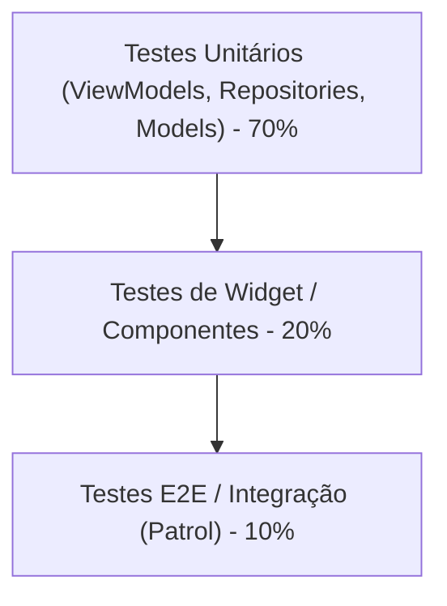

# Estratégia de Testes Automatizados no Flutter

Testes automatizados garantem a estabilidade, refatoração segura e manutenibilidade do aplicativo a longo prazo.

---

## 1. Pirâmide de Testes no Flutter



---

## 2. Testes Unitários de Repositórios com Mocktail

Utilize o pacote **`mocktail`** para criação de mocks rápidos e sem necessidade de code-generation.

```dart
// test/features/products/data/repositories/products_repository_impl_test.dart
import 'package:flutter_test/flutter_test.dart';
import 'package:mocktail/mocktail.dart';
import 'package:my_app/features/products/data/datasources/products_remote_datasource.dart';
import 'package:my_app/features/products/data/models/product_dto.dart';
import 'package:my_app/features/products/data/repositories/products_repository_impl.dart';

class MockProductsRemoteDataSource extends Mock
    implements ProductsRemoteDataSource {}

void main() {
  late MockProductsRemoteDataSource mockRemoteDataSource;
  late ProductsRepositoryImpl repository;

  setUp(() {
    mockRemoteDataSource = MockProductsRemoteDataSource();
    repository = ProductsRepositoryImpl(remoteDataSource: mockRemoteDataSource);
  });

  group('getProducts', () {
    test('deve retornar lista de produtos quando a chamada ao datasource for bem-sucedida', () async {
      // Arrange
      const tProductDto = ProductDto(id: '1', title: 'Produto Teste', price: 99.9);
      when(() => mockRemoteDataSource.fetchProducts())
          .thenAnswer((_) async => [tProductDto]);

      // Act
      final result = await repository.getProducts();

      // Assert
      expect(result.length, 1);
      expect(result.first.id, '1');
      verify(() => mockRemoteDataSource.fetchProducts()).called(1);
    });
  });
}
```

---

## 3. Testes Unitários de ViewModels

### 3.1. Testando ViewModel com Riverpod (`ProviderContainer`)

Para testar ViewModels do Riverpod de forma pura (sem instanciar widgets):

```dart
// test/features/products/presentation/viewmodels/product_list_viewmodel_test.dart
import 'package:flutter_riverpod/flutter_riverpod.dart';
import 'package:flutter_test/flutter_test.dart';
import 'package:mocktail/mocktail.dart';
import 'package:my_app/features/products/domain/entities/product.dart';
import 'package:my_app/features/products/domain/repositories/products_repository.dart';
import 'package:my_app/features/products/presentation/viewmodels/product_list_viewmodel.dart';

class MockProductsRepository extends Mock implements ProductsRepository {}

void main() {
  late MockProductsRepository mockRepository;

  setUp(() {
    mockRepository = MockProductsRepository();
  });

  ProviderContainer makeContainer() {
    final container = ProviderContainer(
      overrides: [
        productsRepositoryProvider.overrideWithValue(mockRepository),
      ],
    );
    addTearDown(container.dispose);
    return container;
  }

  test('deve emitir AsyncData com lista de produtos após inicialização', () async {
    // Arrange
    const tProducts = [Product(id: '1', title: 'Notebook', price: 4500.0)];
    when(() => mockRepository.getProducts()).thenAnswer((_) async => tProducts);

    final container = makeContainer();
    final listener = Listener<AsyncValue<List<Product>>>();

    container.listen(
      productListViewModelProvider,
      listener.call,
      fireImmediately: true,
    );

    // Assert inicial
    verify(() => listener(null, const AsyncLoading())).called(1);

    // Aguarda o carregamento assíncrono
    await container.read(productListViewModelProvider.future);

    // Assert final
    verify(() => listener(const AsyncLoading(), const AsyncData(tProducts))).called(1);
  });
}

class Listener<T> extends Mock {
  void call(T? previous, T next);
}
```

### 3.2. Testando ViewModel com Cubit (`bloc_test`)

```dart
// test/features/products/presentation/viewmodels/products_cubit_test.dart
import 'package:bloc_test/bloc_test.dart';
import 'package:flutter_test/flutter_test.dart';
import 'package:mocktail/mocktail.dart';
import 'package:my_app/features/products/domain/entities/product.dart';
import 'package:my_app/features/products/domain/repositories/products_repository.dart';
import 'package:my_app/features/products/presentation/viewmodels/products_cubit.dart';
import 'package:my_app/features/products/presentation/viewmodels/products_state.dart';

class MockProductsRepository extends Mock implements ProductsRepository {}

void main() {
  late MockProductsRepository mockRepository;

  setUp(() {
    mockRepository = MockProductsRepository();
  });

  const tProducts = [Product(id: '1', title: 'Notebook', price: 4500.0)];

  blocTest<ProductsCubit, ProductsState>(
    'emite [ProductsLoading, ProductsLoaded] quando loadProducts tem sucesso',
    build: () {
      when(() => mockRepository.getProducts()).thenAnswer((_) async => tProducts);
      return ProductsCubit(repository: mockRepository);
    },
    act: (cubit) => cubit.loadProducts(),
    expect: () => [
      ProductsLoading(),
      const ProductsLoaded(tProducts),
    ],
  );
}
```

---

## 4. Testes de Widget (Componentes e Telas)

Valide a renderização e o comportamento da View simulando interações do usuário:

```dart
// test/features/products/presentation/views/product_list_page_test.dart
import 'package:flutter/material.dart';
import 'package:flutter_riverpod/flutter_riverpod.dart';
import 'package:flutter_test/flutter_test.dart';
import 'package:mocktail/mocktail.dart';
import 'package:my_app/features/products/domain/entities/product.dart';
import 'package:my_app/features/products/domain/repositories/products_repository.dart';
import 'package:my_app/features/products/presentation/views/product_list_page.dart';

class MockProductsRepository extends Mock implements ProductsRepository {}

void main() {
  testWidgets('deve renderizar o título do produto na lista', (tester) async {
    final mockRepo = MockProductsRepository();
    when(() => mockRepo.getProducts()).thenAnswer(
      (_) async => const [Product(id: '1', title: 'Mouse Gamer', price: 150.0)],
    );

    await tester.pumpWidget(
      ProviderScope(
        overrides: [
          productsRepositoryProvider.overrideWithValue(mockRepo),
        ],
        child: const MaterialApp(
          home: ProductListPage(),
        ),
      ),
    );

    // Estado inicial: loading indicator visível
    expect(find.byType(CircularProgressIndicator), findsOneWidget);

    // Avança o relógio assíncrono para concluir a animação e Future
    await tester.pumpAndSettle();

    // Estado final: texto do produto renderizado
    expect(find.text('Mouse Gamer'), findsOneWidget);
    expect(find.byType(CircularProgressIndicator), findsNothing);
  });
}
```