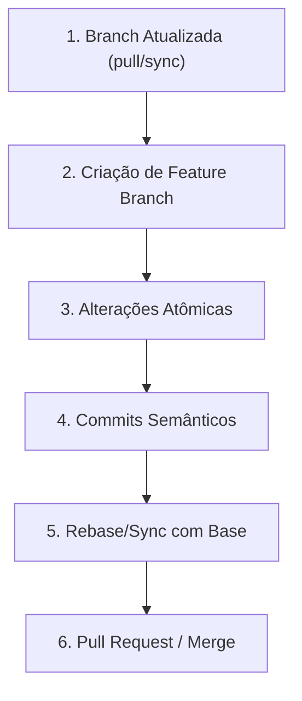

# Git Skill: Padrões de Versionamento e Fluxos de Trabalho

Esta skill orienta o agente e a equipe na gestão profissional de versionamento com Git, garantindo histórico limpo, rastreabilidade e segurança operacional.

---

## Quando Utilizar Esta Skill

Consulte esta skill ao:
1. Criar novas branches para features, correções ou tarefas de infraestrutura.
2. Escrever mensagens de commit padronizadas (*Conventional Commits*).
3. Resolver conflitos de merge ou rebase.
4. Desfazer alterações com segurança sem perda de histórico.
5. Preparar e revisar Pull Requests.

---

## Fluxo Operacional Recomendado

---

## Princípios Fundamentais

1. **Commits Atômicos:** Cada commit deve representar uma alteração única e lógica. Evite commits gigantescos ("faz tudo").
2. **Histórico Linear e Limpo:** Prefira `git pull --rebase` ou rebase interativo antes de submeter PRs para evitar merges vazios desnecessários.
3. **Segurança Primeiro:**
   - Nunca utilize `git push --force` na branch principal (`main`/`master`).
   - Use `git push --force-with-lease` apenas em branches individuais de feature quando necessário após rebase.
   - Em caso de dúvidas sobre alterações pendentes, use `git stash` antes de trocar de contexto.

---

## Guias Detalhados

- 📖 **[Estratégias de Branching e Commits Semânticos](./references/branching-and-commits.md):** Padrão Conventional Commits, nomenclatura de branches e ciclo de vida de Pull Requests.
- 📖 **[Resolução de Conflitos e Recuperação](./references/troubleshooting.md):** Como lidar com conflitos de merge, comandos de desfazer (`revert` vs `reset`), uso do `reflog` e `stash`.
