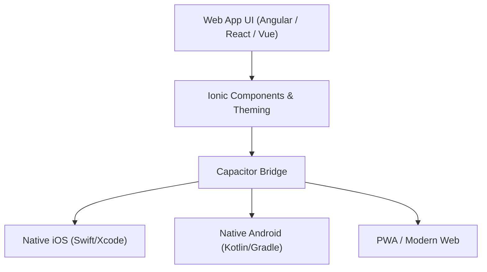

# Ionic Skill: Desenvolvimento Mobile e Multiplataforma

Esta skill orienta o desenvolvimento de aplicativos móveis híbridos de alta performance e fidelidade visual utilizando **Ionic Framework** e **Capacitor**.

---

## Quando Utilizar Esta Skill

Consulte esta skill ao:
1. Criar novas telas, componentes ou fluxos de navegação em aplicações Ionic (Angular, React ou Vue).
2. Integrar recursos nativos de hardware via Capacitor (câmera, biometria, GPS, notificações push, armazenamento seguro).
3. Customizar temas e estilos respeitando as diretrizes de design do iOS (Cupertino) e Android (Material Design).
4. Gerenciar o ciclo de vida específico de páginas Ionic e navegação baseada em stack.
5. Otimizar a performance de renderização, listas longas e build para lojas (Google Play Store e Apple App Store).

---

## Pilares do Ecossistema Ionic

1. **Ionic UI Components:** Componentes Web adaptáveis que adotam automaticamente a experiência nativa da plataforma (iOS vs Android).
2. **Capacitor:** Camada moderna de interoperabilidade que expõe APIs nativas do dispositivo através de interfaces TypeScript limpas.
3. **Navegação em Stack:** Diferente de SPAs tradicionais, páginas anteriores permanecem no DOM e mantêm o estado ao avançar na pilha.

---

## Boas Práticas Fundamentais

- **Use a Estrutura Semântica do Ionic:** Sempre encapsule páginas em `ion-page` e o conteúdo com scroll em `ion-content`.
- **CSS Custom Properties:** Nunca force estilos globais que quebrem o Shadow DOM dos componentes. Utilize as variáveis CSS oficiais do Ionic (`--background`, `--color`, `--padding-start`).
- **Respeite Safe Areas:** Garanta que barras de navegação e botões flutuantes considerem o *notch* e a barra de gestos do sistema operacional.
- **Evite Bloqueio da Thread Principal:** Mantenha animações operando via GPU e operações pesadas assíncronas.

---

## Guias Detalhados

- 📖 **[Integração Nativa com Capacitor](./references/capacitor-native.md):** Plugins oficiais, permissões, ciclo de build nativo e armazenamento local.
- 📖 **[Componentes, Theming e Estilização](./references/components-and-styling.md):** Estrutura de páginas, temas claro/escuro, customização com CSS Variables e responsividade.
- 📖 **[Navegação e Ciclo de Vida de Páginas](./references/lifecycle-and-navigation.md):** Gerenciamento de stack, transições de tela e hooks (`ionViewWillEnter`, `ionViewDidLeave`).
