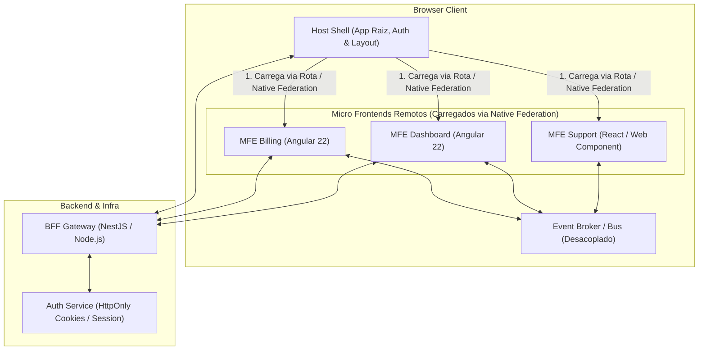

# Micro Frontends (MFE) Skill: Arquitetura, Federação & Governança

Esta skill define as diretrizes de engenharia para desenvolvimento de aplicações web distribuídas em **Micro Frontends (MFE)**, garantindo autonomia de times, deploys desacoplados, isolamento de falhas e alto desempenho em produção.

---

## Quando Utilizar Esta Skill

Consulte e ative esta skill ao:
1. Projetar a arquitetura entre uma aplicação **Shell (Host)** e múltiplos **Remotes (Micro Frontends)**.
2. Configurar federação de módulos moderna utilizando **Native Federation** com `esbuild` e *import maps* nativos do browser.
3. Estabelecer contratos de comunicação assíncronos e desacoplados entre remotes (CustomEvents, BroadcastChannel, Shell Event Broker).
4. Gerenciar dependências compartilhadas (*shared dependencies*) e singletons (Angular core, Signals, Design Tokens).
5. Implementar **Tolerância a Falhas** e *Circuit Breakers* com UI Fallbacks para remotes indisponíveis.
6. Garantir isolamento de estilos (CSS encapsulation) e evitar colisões visuais.
7. Implementar autenticação corporativa segura (via BFF com cookies `HttpOnly`) em ecossistemas multi-aplicação.
8. Criar esteiras de CI/CD para deploy independente de cada micro frontend.

---

## 1. Topologia da Arquitetura MFE



---

## 2. Princípios Fundamentais de MFE

### 2.1. Native Federation (Sem Amarras de Bundler)
- Utilize **`@angular-architects/native-federation`**.
- Baseado em padrões web W3C (*Import Maps* e *ES Modules* nativos), permitindo builds ultrarrápidos com `esbuild` ou `vite`.
- Elimina a dependência de plugins legados do Webpack.

### 2.2. Regra de Ouro da Comunicação
- **Zero Estado Reativo Compartilhado Direto:** Nunca compartilhe instâncias de `BehaviorSubject`, Signals ou Redux Stores entre diferentes remotes. O acoplamento de memória impede deploys autônomos e quebra quando as versões de pacotes divergem.
- **Comunicação por Eventos:** Utilize `CustomEvent` na `window`, `BroadcastChannel` ou uma interface de Event Broker simples fornecida pelo Shell.
- Payload de eventos deve conter apenas **dados primitivos e DTOs serializáveis**, nunca instâncias de classes ou métodos.

### 2.3. Tolerância a Falhas (Fault Tolerance)
- Se o servidor de um micro frontend remoto falhar (HTTP 500 ou timeout de rede), o Shell **não pode crashar**.
- Toda rota remota deve ser encapsulada em um *Error Boundary / Fallback Component* que oferece:
  1. Mensagem de erro amigável ao usuário.
  2. Botão de retry automático.
  3. Telemetria enviada para observabilidade (ex: Datadog / Sentry).

### 2.4. Isolamento Visual e de CSS
- Nunca use seletores globais sem escopo nos micro frontends (`body { ... }`, `h1 { ... }`).
- Garanta que todo componente utilize `ViewEncapsulation.Emulated` (padrão do Angular) ou `ShadowDom`.
- Os Design Tokens (cores, fontes, espaçamentos) devem ser padronizados como variáveis CSS (`--apdev-surface`, `--apdev-accent`) injetadas pelo Shell.

---

## 3. Exemplo de Roteamento com Resiliência no Shell

No arquivo de rotas do Shell (`shell.routes.ts`):

```typescript
import { Routes } from '@angular/router';
import { loadRemoteModule } from '@angular-architects/native-federation';
import { MfeFallbackComponent } from './core/components/mfe-fallback.component';

export const routes: Routes = [
  {
    path: '',
    pathMatch: 'full',
    redirectTo: 'dashboard',
  },
  {
    path: 'dashboard',
    loadChildren: () =>
      loadRemoteModule({
        remoteName: 'mfeDashboard',
        exposedModule: './Routes',
      })
        .then(m => m.routes)
        .catch(err => {
          console.error('[MFE Shell] Falha ao carregar MFE Dashboard:', err);
          return [
            {
              path: '',
              component: MfeFallbackComponent,
              data: { mfeName: 'Dashboard', error: err.message },
            },
          ];
        }),
  },
  {
    path: 'billing',
    loadChildren: () =>
      loadRemoteModule({
        remoteName: 'mfeBilling',
        exposedModule: './Routes',
      })
        .then(m => m.routes)
        .catch(err => {
          console.error('[MFE Shell] Falha ao carregar MFE Billing:', err);
          return [
            {
              path: '',
              component: MfeFallbackComponent,
              data: { mfeName: 'Faturamento & Assinaturas', error: err.message },
            },
          ];
        }),
  },
];
```

---

## 4. Segurança em Micro Frontends

1. **Autenticação Centralizada via BFF:**
   - O Shell e todos os Remotes devem consumir o mesmo domínio ou subdomínio de API.
   - A sessão do usuário deve residir em um cookie seguro gerenciado pelo Backend for Frontend (`HttpOnly; Secure; SameSite=Strict`).
2. **Content Security Policy (CSP):**
   - No cabeçalho CSP, liste explicitamente a origem de cada remote permitido em `script-src` e `connect-src` para evitar injeção de scripts não autorizados.
3. **Subresource Integrity (SRI):**
   - Para deploys em CDN, utilize SRI nos manifestos de importação remota quando as URLs forem estáticas ou versionadas.

---

## 5. Referências Detalhadas

- [Configuração de Native Federation](./references/native-federation.md)
- [Contratos de Comunicação e Event Broker](./references/communication-contracts.md)
- [Segurança, Resiliência e Testes E2E](./references/security-and-resilience.md)
