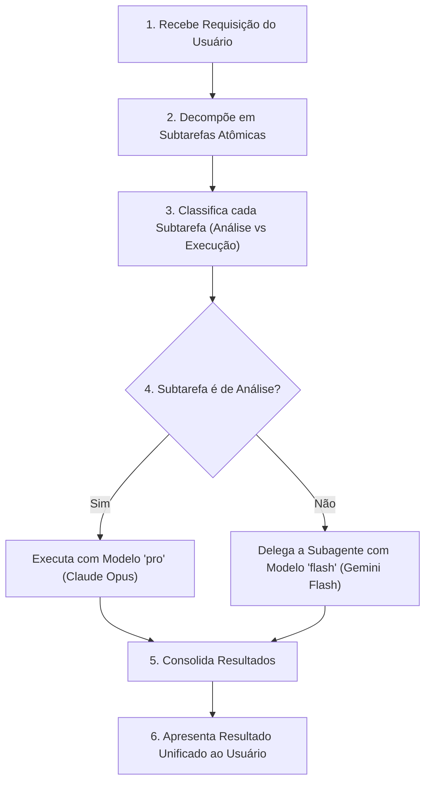

# Orchestrator Skill: Decomposição e Roteamento Inteligente de Tarefas

Esta skill transforma o agente em um **Orquestrador de Engenharia de IA**, capaz de decompor requisições complexas, classificar cada subtarefa por natureza cognitiva e rotear para o modelo mais adequado — maximizando qualidade analítica e velocidade de execução.

---

## Quando Ativar Esta Skill

1. Tarefas complexas que envolvam **análise** (arquitetura, code review, decisão de design) combinada com **execução** (escrita de código, testes, refatoração).
2. Requisições que beneficiem de **paralelismo** — ex: "refatore o módulo X e crie testes para Y".
3. Projetos novos (*greenfield*) que exijam planejamento arquitetural seguido de scaffold de código.
4. Auditorias de codebase que exijam análise profunda e correção simultânea.

---

## Modelo de Roteamento por Capacidade (Model Routing Table)

O roteamento segue o princípio de **especialização cognitiva**: modelos de raciocínio profundo para análise e planejamento, modelos rápidos e eficientes para execução e geração de código.

### Tabela de Roteamento

| Classe de Tarefa | Modelo Preferencial | Parâmetro `Model` (Subagente) | Justificativa |
| :--- | :--- | :--- | :--- |
| **Análise Arquitetural** | Claude Opus (Thinking) | `pro` | Raciocínio em cadeia profundo para decisões de design com trade-offs |
| **Code Review & Auditoria** | Claude Opus (Thinking) | `pro` | Capacidade superior de encontrar bugs sutis e violações de princípios |
| **Planejamento de Testes** | Claude Opus (Thinking) | `pro` | Identificação de cenários de borda e estratégia de cobertura |
| **Decisão de Tecnologia** | Claude Opus (Thinking) | `pro` | Avaliação comparativa ponderada de alternativas |
| **Geração de Código** | Gemini 3.8 Flash (High) | `flash` | Alta velocidade de geração com qualidade consistente |
| **Refatoração Guiada** | Gemini 3.8 Flash (High) | `flash` | Execução rápida seguindo plano já definido |
| **Escrita de Testes** | Gemini 3.8 Flash (High) | `flash` | Geração eficiente de suítes com padrão AAA |
| **Correção de Bugs** | Gemini 3.8 Flash (High) | `flash` | Aplicação cirúrgica de fixes pontuais |
| **Documentação** | Gemini 3.8 Flash (High) | `flash` | Geração fluida de READMEs, JSDoc e comentários |
| **Pesquisa de Codebase** | Gemini Flash (Light) | `flash_lite` | Varredura exploratória rápida sem necessidade de raciocínio profundo |

> **Regra de Fallback:** Se o modelo preferencial não estiver disponível ou o usuário não tiver especificado, utilize `inherit` (herda o modelo ativo da conversa).

---

## Protocolo de Orquestração (Passo a Passo)

### Passo 1: Recepção e Compreensão
- Leia a requisição completa do usuário.
- Identifique o escopo, os projetos envolvidos e as restrições explícitas.

### Passo 2: Decomposição em Subtarefas
- Quebre a requisição em **subtarefas atômicas independentes** (quando possível) ou em **subtarefas sequenciais** (quando há dependência de dados).
- Cada subtarefa deve ter: **Objetivo claro**, **Artefatos de entrada** e **Critério de conclusão**.

### Passo 3: Classificação e Roteamento
Classifique cada subtarefa usando a taxonomia:

**Classe ANÁLISE (→ `pro`):**
- Decisões arquiteturais com trade-offs
- Revisão de código existente
- Diagnóstico de bugs complexos
- Planejamento de estratégia de testes
- Avaliação de riscos e segurança

**Classe EXECUÇÃO (→ `flash`):**
- Geração de código seguindo um plano definido
- Escrita de testes unitários seguindo padrão AAA
- Refatoração mecânica (extrair método, renomear, mover)
- Criação de documentação e scaffolding
- Correção de bugs com causa raiz já identificada

**Classe PESQUISA (→ `flash_lite`):**
- Buscar definições de tipos, imports e dependências no codebase
- Varrer arquivos para mapear estrutura do projeto
- Localizar usos de uma função ou padrão específico

### Passo 4: Execução e Delegação
- **Subtarefas de análise:** Execute diretamente (o orquestrador já deve estar rodando no modelo `pro`).
- **Subtarefas de execução:** Delegue via `invoke_subagent` com `Model: "flash"`.
- **Subtarefas de pesquisa:** Delegue via `invoke_subagent` com `Model: "flash_lite"` ou use subagentes `research`.
- **Subtarefas paralelas** (sem dependência entre si): Lance múltiplos subagentes simultaneamente.
- **Subtarefas sequenciais** (output de uma alimenta outra): Execute em cadeia, consolidando resultados intermediários.

### Passo 5: Consolidação
- Reúna os resultados de todos os subagentes.
- Valide coerência entre os artefatos gerados.
- Resolva conflitos se subagentes divergirem.

### Passo 6: Entrega
- Apresente o resultado unificado ao usuário com links para os arquivos criados/modificados.
- Destaque decisões arquiteturais tomadas e seu raciocínio.

---

## Guias Detalhados

- 📖 **[Padrões de Decomposição de Tarefas](./references/decomposition-patterns.md):** Templates para decompor cenários comuns (feature nova, refatoração, migração, auditoria).
- 📖 **[Exemplos de Roteamento em Ação](./references/routing-examples.md):** Casos práticos com fluxo completo de orquestração.
