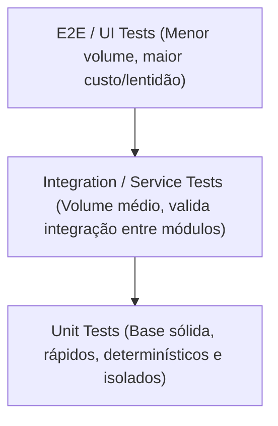

# Testing Skill: Estratégias e Padrões de Testes Automatizados

Esta skill define os padrões e a disciplina de testes automatizados para garantir qualidade de software, ausência de regressões e confiança em deploys contínuos.

---

## Quando Utilizar Esta Skill

Consulte esta skill ao:
1. Criar novas suites ou casos de teste para classes, módulos, serviços ou componentes.
2. Planejar a cobertura de testes para novas funcionalidades (TDD ou pós-implementação).
3. Projetar testes de integração isolando banco de dados e APIs externas com mocks/stubs.
4. Criar testes E2E (End-to-End) simulando fluxos críticos do usuário final.
5. Investigar testes intermitentes (*flaky tests*) ou lentos.

---

## A Pirâmide de Testes

1. **Testes Unitários (Base):** Devem compor a maior parte da suíte. Rápidos, executados em memória, sem tocar I/O real.
2. **Testes de Integração (Meio):** Validam a comunicação entre múltiplos módulos, repositórios com banco em memória/containers e clientes de API.
3. **Testes E2E (Topo):** Validam os fluxos essenciais do usuário de ponta a ponta (login, checkout, navegação principal).

---

## Princípios de Testes (F.I.R.S.T.)

- **Fast (Rápido):** Devem rodar em milissegundos para serem executados continuamente durante o desenvolvimento.
- **Independent (Isolado):** Um teste nunca deve depender do resultado ou do estado deixado por outro teste.
- **Repeatable (Repetível):** Devem produzir o mesmo resultado em qualquer ambiente (máquina local, CI/CD, sem internet).
- **Self-Validating (Autoavaliável):** O teste deve ter um resultado binário claro (passou ou falhou), sem necessidade de inspeção manual de logs.
- **Timely (Oportuno):** Devem ser escritos no momento adequado (junto ou antes do código de produção).

---

## Guardrail de Cobertura e Thresholds Mandatórios

> [!CAUTION]
> **Thresholds Inexistentes ou Cobertura Abaixo do Mínimo Bloqueiam a Entrega.**
> 1. Todo projeto com suíte de testes DEVE ter thresholds de cobertura explicitamente configurados (Vitest, Jest, Karma, etc.).
> 2. Padrão mínimo global: **80% de Linhas, Declarações, Funções e Ramos**.
> 3. Em projetos legados com baixa cobertura, aplique **Ratcheting**: fixe o threshold no patamar atual para prevenir regressões e aumente progressivamente a cada nova entrega.
> 4. A execução de testes DEVE rodar com `--coverage` e passar com exit code 0 sem falha de threshold.

---

## Guias Detalhados

- 🛡️ **[Guardrail de Cobertura e Thresholds](./references/coverage-thresholds-guardrail.md):** Regras mandatórias de bloqueio, sintaxe correta por test runner (Vitest vs Jest vs Karma) e ratcheting.
- 📖 **[Testes Unitários e Mocking](./references/unit-testing.md):** Estrutura AAA (Arrange-Act-Assert), fakes, mocks, stubs e boas práticas de asserção.
- 📖 **[Testes de Integração e E2E](./references/integration-e2e.md):** Estratégias de banco de testes, isolamento de rede, Playwright/Cypress e prevenção de testes flaky.
- 📋 **[Checklist de Validação de Testes](./references/test-checklist.md):** Verificações essenciais antes de aprovar novas suites de teste.
