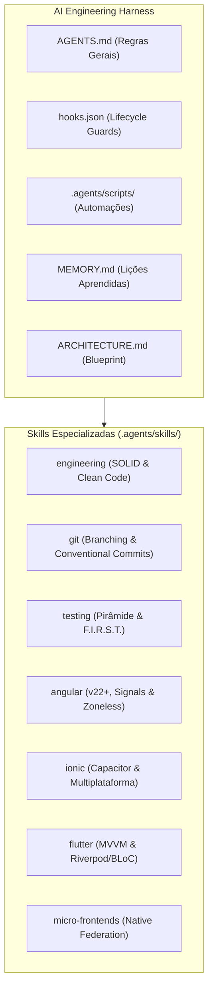

# Blueprint de Arquitetura de Software & Contexto do Sistema

Este documento serve como a **Fonte Única da Verdade Arquitetural** (*Single Source of Truth*) para agentes de IA e engenheiros humanos atuando neste ecossistema.

---

## 1. Visão Geral do Ecossistema

O repositório **AI-Engineering** atua como um **Harness Central de Engenharia de IA** e repositório de inteligência corporativa. Ele provê padrões arquiteturais, automações e pacotes de habilidades (*skills*) operadas via *Progressive Disclosure*.

---

## 2. Padrões Arquiteturais por Plataforma

### 2.1. Web Corporativo (Angular 22+)
- **Paradigma:** Standalone Components, Zoneless Change Detection (`provideExperimentalZonelessChangeDetection()`).
- **Estado:** Signals reativos nativos (`signal()`, `computed()`, `linkedSignal()`) e NgRx SignalStore para estado compartilhado.
- **Renderização:** Novo Control Flow (`@if`, `@for`, `@switch`, `@defer`).

### 2.2. Mobile Multiplataforma Híbrido (Ionic & Capacitor)
- **Paradigma:** Single Web Codebase com ponte nativa Capacitor.
- **Navegação:** Stack Navigation com ciclo de vida Ionic (`ionViewWillEnter`, `ionViewDidLeave`).
- **Estilização:** CSS Shadow Parts e Custom Properties (`--background`, `--color`).

### 2.3. Mobile Multiplataforma Nativo (Flutter & Dart)
- **Paradigma:** MVVM (Model-View-ViewModel).
- **Gerenciamento de Estado:** Riverpod (padrão principal) com `AsyncNotifier` ou BLoC/Cubit para fluxos de negócio complexos.
- **Design:** Material 3 declarativo e responsivo.

### 2.4. Arquitetura Distribuída (Micro-Frontends)
- **Paradigma:** Native Federation com esbuild.
- **Shell vs Remotes:** Shell orquestra autenticação e layout principal; Remotes expõem recursos desacoplados.
- **Comunicação:** Custom Events isolados, contratos TypeScript compartilhados e tolerância a falhas (Fallbacks/Error Boundaries).

---

## 3. Diretrizes de Integração de Novos Projetos

Ao conectar um novo repositório a este harness:
1. Execute `.agents/scripts/repo-map.ps1 -ProjectPath <caminho>` para mapear a stack e topologia.
2. Copie ou sincronize os arquivos necessários via `.agents/scripts/sync-projects.ps1` ou instale globalmente com `.agents/scripts/sync-global.ps1`.
3. Adicione particularidades de negócio ou versões de libs em `MEMORY.md`.
